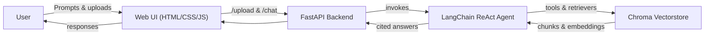

## System Diagram

```mermaid
flowchart LR
    User -->|Prompts & uploads| WebUI["Web UI (HTML/CSS/JS)"]
    WebUI -->|/upload & /chat| Backend["FastAPI Backend"]
    Backend -->|invokes| Agent["LangChain ReAct Agent"]
    Agent -->|tools & retrievers| Vectorstore["Chroma Vectorstore"]
    Vectorstore -->|chunks & embeddings| Agent
    Agent -->|cited answers| Backend --> WebUI -->|responses| User
```

